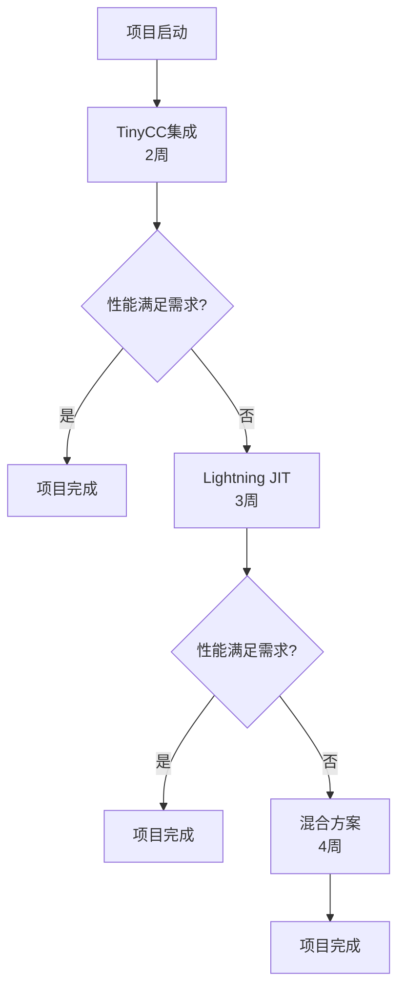

# 技术方案对比分析 / Technical Comparison Analysis

## 概述 / Overview

本文档对比分析了四种主要的newLISP二进制编译方案，为项目决策提供技术依据。

This document provides a comparative analysis of four major newLISP binary compilation approaches to support project decision-making.

## 方案对比矩阵 / Comparison Matrix

| 方案 / Approach | 开发成本 / Dev Cost | 技术难度 / Difficulty | 性能提升 / Performance | 二进制增量 / Binary Size | 维护成本 / Maintenance | ROI |
|------------------|---------------------|----------------------|------------------------|--------------------------|------------------------|-----|
| TinyCC集成 / TinyCC Integration | 15人天 / 15 person-days | 2/5 | 2-5x | +500KB | 低 / Low | ⭐⭐⭐⭐⭐ |
| GNU Lightning JIT | 25人天 / 25 person-days | 3/5 | 3-6x | +800KB | 低 / Low | ⭐⭐⭐⭐ |
| LLVM后端 / LLVM Backend | 70人天 / 70 person-days | 4/5 | 10-50x | +8MB | 高 / High | ⭐⭐⭐ |
| 自研JIT / Custom JIT | 35人天 / 35 person-days | 3/5 | 3-8x | +300KB | 中 / Medium | ⭐⭐⭐⭐ |
| 混合方案 / Hybrid Approach | 35人天 / 35 person-days | 3/5 | 5-15x | +1MB | 中 / Medium | ⭐⭐⭐⭐⭐ |

## 详细分析 / Detailed Analysis

### 1. TinyCC集成方案 / TinyCC Integration

**技术特点 / Technical Features:**
- 基于成熟的C编译器 / Based on mature C compiler
- AST到C代码转换 / AST to C code conversion
- 运行时编译能力 / Runtime compilation capability

**优势 / Advantages:**
```
✅ 开发成本最低 / Lowest development cost
✅ 技术风险可控 / Controllable technical risk
✅ 快速原型验证 / Rapid prototype validation
✅ 真正的机器码输出 / True machine code output
```

**劣势 / Disadvantages:**
```
❌ 性能提升有限 / Limited performance improvement
❌ 依赖外部库 / External library dependency
❌ C语言语义限制 / C language semantic limitations
```

**适用场景 / Use Cases:**
- 快速MVP实现 / Rapid MVP implementation
- 概念验证 / Proof of concept
- 渐进式迁移起点 / Progressive migration starting point

### 2. GNU Lightning JIT方案 / GNU Lightning JIT

**技术特点 / Technical Features:**
- 轻量级JIT编译框架 / Lightweight JIT compilation framework
- 跨平台机器码生成 / Cross-platform machine code generation
- 运行时优化能力 / Runtime optimization capability

**优势 / Advantages:**
```
✅ 更好的性能表现 / Better performance
✅ 跨平台支持 / Cross-platform support
✅ 相对轻量 / Relatively lightweight
✅ 成熟的API / Mature API
```

**劣势 / Disadvantages:**
```
❌ 学习曲线陡峭 / Steep learning curve
❌ 调试困难 / Debugging difficulties
❌ 平台相关性 / Platform dependencies
```

### 3. LLVM后端方案 / LLVM Backend

**技术特点 / Technical Features:**
- 工业级编译器基础设施 / Industrial-grade compiler infrastructure
- 强大的优化能力 / Powerful optimization capabilities
- 多目标平台支持 / Multi-target platform support

**优势 / Advantages:**
```
✅ 最佳性能表现 / Best performance
✅ 强大的优化 / Powerful optimization
✅ 工业级稳定性 / Industrial-grade stability
✅ 丰富的工具链 / Rich toolchain
```

**劣势 / Disadvantages:**
```
❌ 开发成本极高 / Extremely high development cost
❌ 二进制体积大 / Large binary size
❌ 复杂的依赖关系 / Complex dependencies
❌ 长期维护负担 / Long-term maintenance burden
```

## 推荐决策路径 / Recommended Decision Path

### 阶段性实施策略 / Phased Implementation Strategy



### 决策标准 / Decision Criteria

1. **性能需求 / Performance Requirements**
   - 2-4倍提升 → TinyCC方案
   - 4-8倍提升 → Lightning JIT方案
   - 8倍以上提升 → 混合方案或LLVM

2. **资源约束 / Resource Constraints**
   - 时间紧迫 → TinyCC方案
   - 人力有限 → TinyCC或Lightning
   - 长期项目 → 混合方案

3. **部署环境 / Deployment Environment**
   - IoT设备 → TinyCC或自研JIT
   - 服务器环境 → 任意方案
   - 嵌入式系统 → TinyCC方案

## 风险评估 / Risk Assessment

### 技术风险 / Technical Risks

| 风险类型 / Risk Type | TinyCC | Lightning | LLVM | 自研JIT | 混合方案 |
|---------------------|--------|-----------|------|---------|----------|
| 实现复杂度 / Implementation Complexity | 低 / Low | 中 / Medium | 高 / High | 中 / Medium | 中 / Medium |
| 性能回归 / Performance Regression | 低 / Low | 中 / Medium | 低 / Low | 高 / High | 中 / Medium |
| 兼容性问题 / Compatibility Issues | 中 / Medium | 中 / Medium | 低 / Low | 高 / High | 中 / Medium |
| 维护负担 / Maintenance Burden | 低 / Low | 低 / Low | 高 / High | 高 / High | 中 / Medium |

### 缓解策略 / Mitigation Strategies

1. **渐进式实施 / Progressive Implementation**
   - 保持解释器作为后备 / Keep interpreter as fallback
   - 分阶段验证功能 / Validate functionality in phases
   - 持续性能监控 / Continuous performance monitoring

2. **质量保证 / Quality Assurance**
   - 全面的测试覆盖 / Comprehensive test coverage
   - 自动化回归测试 / Automated regression testing
   - 性能基准测试 / Performance benchmarking

3. **技术债务管理 / Technical Debt Management**
   - 定期代码审查 / Regular code reviews
   - 文档同步更新 / Synchronized documentation updates
   - 重构计划制定 / Refactoring planning

## 结论 / Conclusion

基于综合分析，推荐采用**TinyCC集成方案**作为项目起点，具备以下优势：

Based on comprehensive analysis, we recommend the **TinyCC Integration approach** as the project starting point, with the following advantages:

- 最佳的投入产出比 / Best ROI
- 最低的技术风险 / Lowest technical risk
- 快速的价值验证 / Rapid value validation
- 为后续优化奠定基础 / Foundation for future optimization
